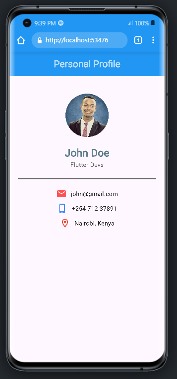
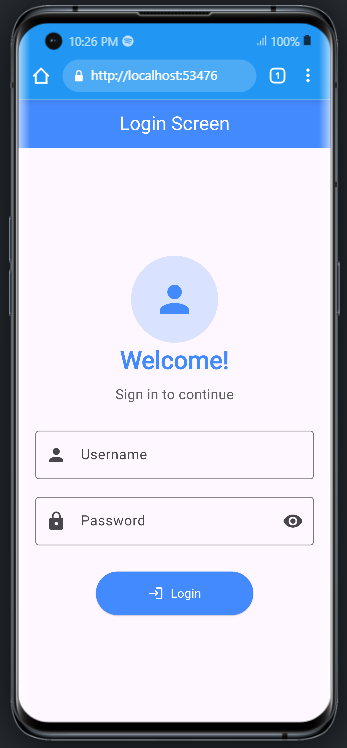

# myprofile

A new Flutter project.

## Getting Started

This project is a starting point for a Flutter application.

A few resources to get you started if this is your first Flutter project:

- [Lab: Write your first Flutter app](https://docs.flutter.dev/get-started/codelab)
- [Cookbook: Useful Flutter samples](https://docs.flutter.dev/cookbook)

For help getting started with Flutter development, view the
[online documentation](https://docs.flutter.dev/), which offers tutorials,
samples, guidance on mobile development, and a full API reference.

## App One Profile


```dart
import 'package:flutter/material.dart';

void main(){
  runApp(MyApp());
}

class MyApp extends StatelessWidget {
  const MyApp({super.key});

  @override
  Widget build(BuildContext context) {
    return MaterialApp(
      debugShowCheckedModeBanner: false,
      home: Scaffold(
        appBar: AppBar(
          title: Text("Personal Profile",style: 
          TextStyle(
            fontStyle: FontStyle.normal,
            fontWeight: FontWeight.bold,
            color: Colors.white70,
          ),),
          backgroundColor: Colors.blue,
          centerTitle: true,
        ),

        body: Padding(
          padding: EdgeInsets.only(top: 40.0),
          child:Center(
            child: Column(
              crossAxisAlignment: CrossAxisAlignment.center,
              children: [
                CircleAvatar(
                  radius: 50,
                  backgroundImage: AssetImage('assets/avatar.png'),

                ),
                SizedBox(height: 20,),
                Text("John Doe",
                style: TextStyle(
                  fontWeight: FontWeight.bold,
                  fontSize: 24,
                  color: Colors.blueGrey,
                  
                  ),
                ),
                Text('Flutter Devs',
                  style: TextStyle(
                  color: Colors.grey[700]),
                ),
                SizedBox(height: 20,),
                Divider(
                  thickness: 3,
                  color: Colors.grey[700],
                  indent: 20,
                  endIndent: 20,
                  height: 5
                ),

                SizedBox(height: 20,),

                Row(
                  mainAxisAlignment: MainAxisAlignment.center,
                  children: [
                    Icon(Icons.email, color: Colors.redAccent),
                    SizedBox(width: 10),
                    Text('john@gmail.com'),
                  ],
                ),
                SizedBox(height: 10),
                Row(
                  mainAxisAlignment: MainAxisAlignment.center,
                  children: [
                    Icon(Icons.phone_iphone, color: Colors.blueAccent),
                    SizedBox(width: 10),
                    Text('+254 712 37891'),
                  ],
                ),
                SizedBox(height: 10),
                Row(
                  mainAxisAlignment: MainAxisAlignment.center,
                  children: [
                    Icon(Icons.location_on_outlined, color: Colors.red),
                    SizedBox(width: 10),
                    Text('Nairobi, Kenya'),
                  ],
                ),

              ],
                
            )              
          )
      
          ),
        ),
      );
      
    
  }
}
```
## Login App


```dart
import 'package:flutter/material.dart';

void main() => runApp(LoginApp());

// The main widget that runs the app
class LoginApp extends StatelessWidget {
  const LoginApp({super.key});

  @override
  Widget build(BuildContext context) {
    return MaterialApp(
      title: 'Login Page',
      debugShowCheckedModeBanner: false, // Hides the debug banner
      home: Scaffold(
        appBar: AppBar(
          title: Text('Login Screen'), // App bar title
          centerTitle: true, // Center the title
          backgroundColor: Colors.blueAccent, // App bar color
          foregroundColor:Colors.white,
        ),
        body: LoginForm(), // The main login form widget
      ),
    );
  }
}

// A stateful widget for the login form
class LoginForm extends StatefulWidget {
  const LoginForm({super.key});

  @override
  _LoginFormState createState() => _LoginFormState();
}

// This is where the form logic lives
class _LoginFormState extends State<LoginForm> {
  // Key to uniquely identify the form and manage validation
  final _formKey = GlobalKey<FormState>();

  // Variables to store user input
  String username = '';
  String password = '';
  bool hidePassword = true; // Controls visibility of password

  @override
  Widget build(BuildContext context) {
    return Padding(
      padding: EdgeInsets.all(20), // Adds padding around the form
      child: Form(
        key: _formKey,
        child: Column(
          mainAxisAlignment: MainAxisAlignment.center, // Center content vertically
          children: [

            // 🔽 Login image at the top
            CircleAvatar(
              radius: 50,
              backgroundColor: Colors.blueAccent.withOpacity(0.2),
              child: Icon(
                Icons.person,
                size: 50,
                color: Colors.blueAccent,
              ),
            ),

            //  Welcome message
            Text(
              'Welcome!',
              style: TextStyle(
                fontSize: 28,           // Bigger font size
                fontWeight: FontWeight.bold,
                color: Colors.blueAccent,
              ),
            ),
            SizedBox(height: 8), // Small spacing

            //  Sub-message
            Text(
              'Sign in to continue',
              style: TextStyle(
                fontSize: 16,
                color: Colors.grey[700],
              ),
            ),
            SizedBox(height: 30), // Spacing before the image
            
            // Username input field
            TextFormField(
              decoration: InputDecoration(
                labelText: 'Username', // Label inside the field
                border: OutlineInputBorder(), // Adds border
                prefixIcon: Icon(Icons.person), // Icon at the start
              ),
              onChanged: (val) => username = val, // Stores user input
            ),
            SizedBox(height: 20), // Adds space between fields

            // Password input field
            TextFormField(
              obscureText: hidePassword, // Hides text if true
              decoration: InputDecoration(
                labelText: 'Password',
                border: OutlineInputBorder(),
                prefixIcon: Icon(Icons.lock),
                suffixIcon: IconButton(
                  icon: Icon(
                    // Toggle icon based on state
                    hidePassword ? Icons.visibility : Icons.visibility_off,
                  ),
                  onPressed: () {
                    // Toggle hidePassword value
                    setState(() => hidePassword = !hidePassword);
                  },
                ),
              ),
              onChanged: (val) => password = val,
            ),
            SizedBox(height: 30), // Space before login button

            // Login button
            ElevatedButton.icon(
              onPressed: () {
                // Action when login is pressed
                print('Login pressed');
                print('Username: $username');
                print('Password: $password');
              },
              style: ElevatedButton.styleFrom(
                iconColor: Colors.white,
                backgroundColor: Colors.blueAccent,
                padding: EdgeInsets.symmetric(horizontal: 60, vertical: 15),
              ),
              icon: Icon(Icons.login_rounded),
              label: Text('Login',style: TextStyle(color: Colors.white),),
              
            ),
          ],
        ),
      ),
    );
  }
}
```
