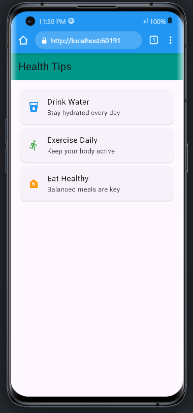
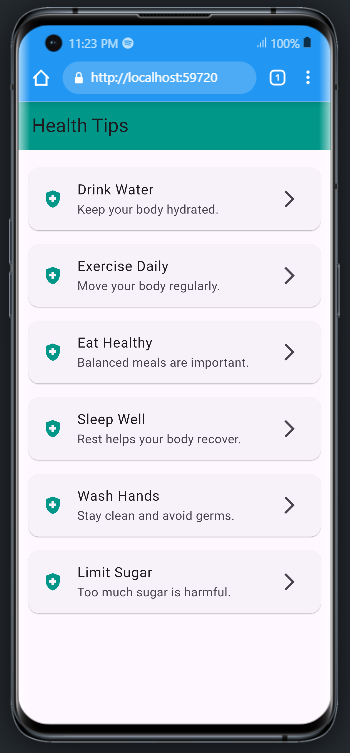

# myprofile

A new Flutter project.

## Getting Started

This project is a starting point for a Flutter application.

A few resources to get you started if this is your first Flutter project:

- [Lab: Write your first Flutter app](https://docs.flutter.dev/get-started/codelab)
- [Cookbook: Useful Flutter samples](https://docs.flutter.dev/cookbook)

For help getting started with Flutter development, view the
[online documentation](https://docs.flutter.dev/), which offers tutorials,
samples, guidance on mobile development, and a full API reference.

## App One Profile


```dart
import 'package:flutter/material.dart';

void main(){
  runApp(MyApp());
}

class MyApp extends StatelessWidget {
  const MyApp({super.key});

  @override
  Widget build(BuildContext context) {
    return MaterialApp(
      debugShowCheckedModeBanner: false,
      home: Scaffold(
        appBar: AppBar(
          title: Text("Personal Profile",style: 
          TextStyle(
            fontStyle: FontStyle.normal,
            fontWeight: FontWeight.bold,
            color: Colors.white70,
          ),),
          backgroundColor: Colors.blue,
          centerTitle: true,
        ),

        body: Padding(
          padding: EdgeInsets.only(top: 40.0),
          child:Center(
            child: Column(
              crossAxisAlignment: CrossAxisAlignment.center,
              children: [
                CircleAvatar(
                  radius: 50,
                  backgroundImage: AssetImage('assets/avatar.png'),

                ),
                SizedBox(height: 20,),
                Text("John Doe",
                style: TextStyle(
                  fontWeight: FontWeight.bold,
                  fontSize: 24,
                  color: Colors.blueGrey,
                  
                  ),
                ),
                Text('Flutter Devs',
                  style: TextStyle(
                  color: Colors.grey[700]),
                ),
                SizedBox(height: 20,),
                Divider(
                  thickness: 3,
                  color: Colors.grey[700],
                  indent: 20,
                  endIndent: 20,
                  height: 5
                ),

                SizedBox(height: 20,),

                Row(
                  mainAxisAlignment: MainAxisAlignment.center,
                  children: [
                    Icon(Icons.email, color: Colors.redAccent),
                    SizedBox(width: 10),
                    Text('john@gmail.com'),
                  ],
                ),
                SizedBox(height: 10),
                Row(
                  mainAxisAlignment: MainAxisAlignment.center,
                  children: [
                    Icon(Icons.phone_iphone, color: Colors.blueAccent),
                    SizedBox(width: 10),
                    Text('+254 712 37891'),
                  ],
                ),
                SizedBox(height: 10),
                Row(
                  mainAxisAlignment: MainAxisAlignment.center,
                  children: [
                    Icon(Icons.location_on_outlined, color: Colors.red),
                    SizedBox(width: 10),
                    Text('Nairobi, Kenya'),
                  ],
                ),

              ],
                
            )              
          )
      
          ),
        ),
      );
      
    
  }
}
```
## Login App


```dart
import 'package:flutter/material.dart';

void main() => runApp(LoginApp());

// The main widget that runs the app
class LoginApp extends StatelessWidget {
  const LoginApp({super.key});

  @override
  Widget build(BuildContext context) {
    return MaterialApp(
      title: 'Login Page',
      debugShowCheckedModeBanner: false, // Hides the debug banner
      home: Scaffold(
        appBar: AppBar(
          title: Text('Login Screen'), // App bar title
          centerTitle: true, // Center the title
          backgroundColor: Colors.blueAccent, // App bar color
          foregroundColor:Colors.white,
        ),
        body: LoginForm(), // The main login form widget
      ),
    );
  }
}

// A stateful widget for the login form
class LoginForm extends StatefulWidget {
  const LoginForm({super.key});

  @override
  _LoginFormState createState() => _LoginFormState();
}

// This is where the form logic lives
class _LoginFormState extends State<LoginForm> {
  // Key to uniquely identify the form and manage validation
  final _formKey = GlobalKey<FormState>();

  // Variables to store user input
  String username = '';
  String password = '';
  bool hidePassword = true; // Controls visibility of password

  @override
  Widget build(BuildContext context) {
    return SingleChildScrollView(
      padding: EdgeInsets.all(20), // Adds padding around the form
      child: Form(
        key: _formKey,
        child: Column(
          mainAxisAlignment: MainAxisAlignment.center, // Center content vertically
          children: [

            // 🔽 Login image at the top
            CircleAvatar(
              radius: 50,
              backgroundColor: Colors.blueAccent.withOpacity(0.2),
              child: Icon(
                Icons.person,
                size: 50,
                color: Colors.blueAccent,
              ),
            ),

            //  Welcome message
            Text(
              'Welcome!',
              style: TextStyle(
                fontSize: 28,           // Bigger font size
                fontWeight: FontWeight.bold,
                color: Colors.blueAccent,
              ),
            ),
            SizedBox(height: 8), // Small spacing

            //  Sub-message
            Text(
              'Sign in to continue',
              style: TextStyle(
                fontSize: 16,
                color: Colors.grey[700],
              ),
            ),
            SizedBox(height: 30), // Spacing before the image
            
            // Username input field
            TextFormField(
              decoration: InputDecoration(
                labelText: 'Username', // Label inside the field
                border: OutlineInputBorder(), // Adds border
                prefixIcon: Icon(Icons.person), // Icon at the start
              ),
              onChanged: (val) => username = val, // Stores user input
            ),
            SizedBox(height: 20), // Adds space between fields

            // Password input field
            TextFormField(
              obscureText: hidePassword, // Hides text if true
              decoration: InputDecoration(
                labelText: 'Password',
                border: OutlineInputBorder(),
                prefixIcon: Icon(Icons.lock),
                suffixIcon: IconButton(
                  icon: Icon(
                    // Toggle icon based on state
                    hidePassword ? Icons.visibility : Icons.visibility_off,
                  ),
                  onPressed: () {
                    // Toggle hidePassword value
                    setState(() => hidePassword = !hidePassword);
                  },
                ),
              ),
              onChanged: (val) => password = val,
            ),
            SizedBox(height: 30), // Space before login button

            // Login button
            ElevatedButton.icon(
              onPressed: () {
                // Action when login is pressed
                print('Login pressed');
                print('Username: $username');
                print('Password: $password');
              },
              style: ElevatedButton.styleFrom(
                iconColor: Colors.white,
                backgroundColor: Colors.blueAccent,
                padding: EdgeInsets.symmetric(horizontal: 60, vertical: 15),
              ),
              icon: Icon(Icons.login_rounded),
              label: Text('Login',style: TextStyle(color: Colors.white),),
              
            ),
          ],
        ),
      ),
    );
  }
}
```

## Health Tip Card


```dart
import 'package:flutter/material.dart';

void main() => runApp(HealthApp());

class HealthApp extends StatelessWidget {
  @override
  Widget build(BuildContext context) {
    return MaterialApp(
      title: 'Simple Health Tips',
      debugShowCheckedModeBanner: false,
      home: HomePage(),
    );
  }
}

// 🔹 Home screen with 3 individual cards
class HomePage extends StatelessWidget {
  @override
  Widget build(BuildContext context) {
    return Scaffold(
      appBar: AppBar(
        title: Text('Health Tips'),
        backgroundColor: Colors.teal,
      ),
      body: Padding(
        padding: EdgeInsets.all(16),
        child: Column(
          children: [
            // 🥤 Tip 1
            Card(
              child: ListTile(
                leading: Icon(Icons.local_drink, color: Colors.blue),
                title: Text('Drink Water'),
                subtitle: Text('Stay hydrated every day'),
                onTap: () {
                  Navigator.push(
                    context,
                    MaterialPageRoute(
                      builder: (_) => TipPage(
                        title: 'Drink Water',
                        content:
                            'Drinking enough water helps you stay focused, energetic, and healthy.',
                      ),
                    ),
                  );
                },
              ),
            ),

            // 🏃 Tip 2
            Card(
              child: ListTile(
                leading: Icon(Icons.directions_run, color: Colors.green),
                title: Text('Exercise Daily'),
                subtitle: Text('Keep your body active'),
                onTap: () {
                  Navigator.push(
                    context,
                    MaterialPageRoute(
                      builder: (_) => TipPage(
                        title: 'Exercise Daily',
                        content:
                            'Exercise improves your mood and strengthens your heart and muscles.',
                      ),
                    ),
                  );
                },
              ),
            ),

            // 🍎 Tip 3
            Card(
              child: ListTile(
                leading: Icon(Icons.food_bank, color: Colors.orange),
                title: Text('Eat Healthy'),
                subtitle: Text('Balanced meals are key'),
                onTap: () {
                  Navigator.push(
                    context,
                    MaterialPageRoute(
                      builder: (_) => TipPage(
                        title: 'Eat Healthy',
                        content:
                            'Eating vegetables, fruits, and whole grains supports a strong immune system.',
                      ),
                    ),
                  );
                },
              ),
            ),

            // 👩‍🎓 Students can add 3 more here by copying the structure above
          ],
        ),
      ),
    );
  }
}

// 🔹 New screen (like Android activity) for each tip
class TipPage extends StatelessWidget {
  final String title;
  final String content;

  const TipPage({required this.title, required this.content});

  @override
  Widget build(BuildContext context) {
    return Scaffold(
      appBar: AppBar(
        title: Text(title),
        backgroundColor: Colors.teal,
      ),
      body: Padding(
        padding: EdgeInsets.all(20),
        child: Text(
          content,
          style: TextStyle(fontSize: 18),
        ),
      ),
    );
  }
}

```

## Health Tips using List Builder


```dart
import 'package:flutter/material.dart';

// This is the starting point of the app
void main() => runApp(HealthApp());

// Root widget of the app
class HealthApp extends StatelessWidget {
  @override
  Widget build(BuildContext context) {
    return MaterialApp(
      title: 'Health Tips',
      debugShowCheckedModeBanner: false, // Removes the debug banner
      home: HomePage(), // Loads the HomePage widget
    );
  }
}

// Main screen showing a list of health tips
class HomePage extends StatelessWidget {
  // List of health tips: each tip has a title, subtitle, and detailed content
  final List<Map<String, String>> tips = [
    // 👩‍🏫 Teacher's 3 health tips
    {
      'title': 'Drink Water',
      'subtitle': 'Keep your body hydrated.',
      'content': 'Drink at least 8 glasses of water every day.'
    },
    {
      'title': 'Exercise Daily',
      'subtitle': 'Move your body regularly.',
      'content': '30 minutes of activity helps your heart and muscles.'
    },
    {
      'title': 'Eat Healthy',
      'subtitle': 'Balanced meals are important.',
      'content': 'Fruits, vegetables, and whole grains keep you strong.'
    },

    // 👨‍🎓 Students will add these 3 tips or create their own
    {
      'title': 'Sleep Well',
      'subtitle': 'Rest helps your body recover.',
      'content': 'Aim for 7–9 hours of sleep each night.'
    },
    {
      'title': 'Wash Hands',
      'subtitle': 'Stay clean and avoid germs.',
      'content': 'Wash hands before eating and after using the toilet.'
    },
    {
      'title': 'Limit Sugar',
      'subtitle': 'Too much sugar is harmful.',
      'content': 'Choose natural snacks and reduce soft drinks.'
    },
  ];

  @override
  Widget build(BuildContext context) {
    return Scaffold(
      appBar: AppBar(
        title: Text('Health Tips'), // App bar title
        backgroundColor: Colors.teal, // App bar color
      ),
      body: ListView.builder(
        padding: EdgeInsets.all(12), // Adds spacing around the list
        itemCount: tips.length, // Total number of tips
        itemBuilder: (context, index) {
          final tip = tips[index]; // Get current tip

          // Each tip is shown in a card with an icon, title and subtitle
          return Card(
            margin: EdgeInsets.symmetric(vertical: 8), // Spacing between cards
            child: ListTile(
              leading: Icon(Icons.health_and_safety, color: Colors.teal), // Icon
              title: Text(tip['title']!), // Tip title
              subtitle: Text(tip['subtitle']!), // Tip subtitle
              trailing: Icon(Icons.arrow_forward_ios), // Arrow icon
              onTap: () {
                // When the user taps, go to the details screen
                Navigator.push(
                  context,
                  MaterialPageRoute(
                    builder: (_) => TipDetail(
                      title: tip['title']!,
                      content: tip['content']!,
                    ),
                  ),
                );
              },
            ),
          );
        },
      ),
    );
  }
}

// Second screen that shows more details about each health tip
class TipDetail extends StatelessWidget {
  final String title;
  final String content;

  const TipDetail({required this.title, required this.content});

  @override
  Widget build(BuildContext context) {
    return Scaffold(
      appBar: AppBar(
        title: Text(title), // Shows the title of the tip
        backgroundColor: Colors.teal,
      ),
      body: Padding(
        padding: EdgeInsets.all(20), // Space around the content
        child: Text(
          content, // Detailed content of the health tip
          style: TextStyle(fontSize: 18), // Font styling
        ),
      ),
    );
  }
}
```
